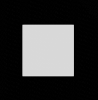
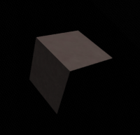
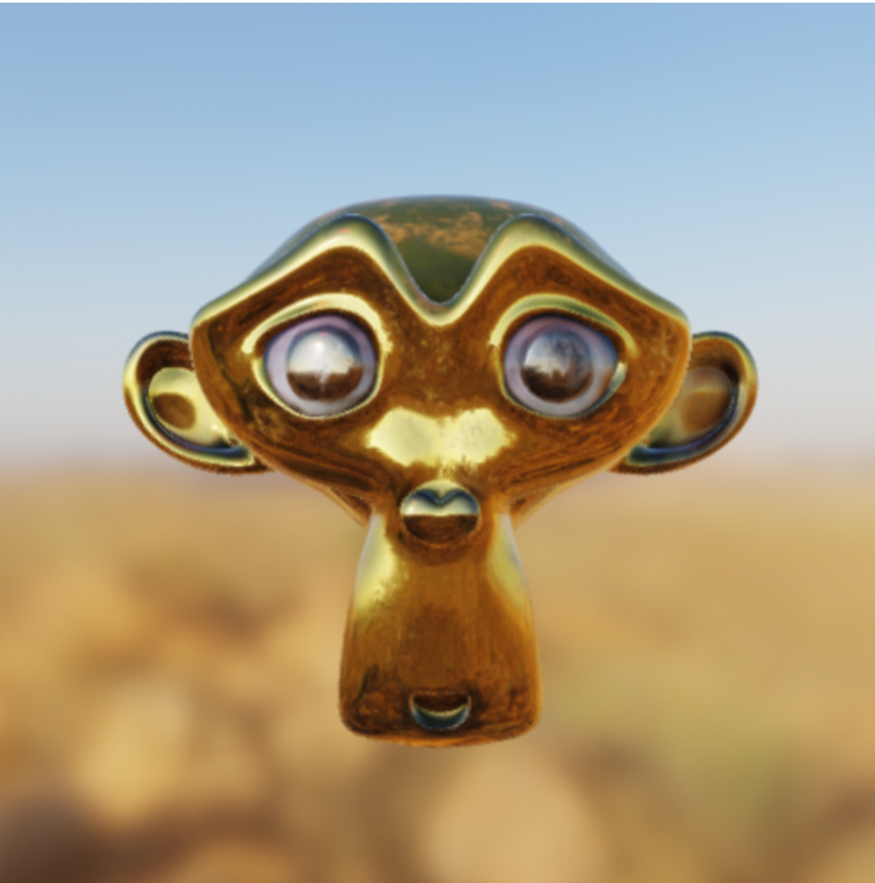
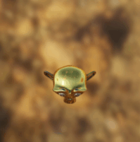

# pbr-scene

A simple web component for using [filament](https://github.com/google/filament/) easily.

# Before you start

*Filament ONLY works on [browsers with WebGL2](https://caniuse.com/#feat=webgl2)*

Google created a really awesome physically based rendering library with a catch that you have to convert your meshes and define materials to its `.filamesh` and `.filamat` formats. So don't be confused if you see these file formats you don't recognize. They are just generated from the tools `filamesh` and `matc` you can download here https://github.com/google/filament/releases.

* `.filamesh` - a very optimized mesh file generated from an (obj,fbx,gltf,.etc);
* `.filamat` - a compessed collection of shaders for a set of inputs for various platforms
* `.ktx` - a very optimized image format for rendering

If you need a skybox, just use the default sky map in the root `simple_skybox.ktx` and its indirect light map `simple_ibl.ktx`

If you need a pbr material shader file, just use the default i have in the root of this project `pbr.mat`, or learn how to invent your own at https://google.github.io/filament/Materials.md.html

# Hello cube

The most basic cube with no material.



```html
<script src="https://unpkg.com/@webcomponents/webcomponentsjs@latest/webcomponents-loader.js"></script>
<script src="https://cdn.jsdelivr.net/npm/filament@1.1.0/filament.min.js"></script>
<script src="https://cdnjs.cloudflare.com/ajax/libs/gl-matrix/2.8.1/gl-matrix-min.js"></script>
<script src="http://unpkg.com/pbr-scene@latest/pbr-scene.js"></script>
<pbr-scene width="500" height="500">
  <pbr-asset name="c_mesh" src="cube.filamesh"></pbr-asset>
  <pbr-camera></pbr-camera>
  <pbr-model mesh="c_mesh"></pbr-model>
</pbr-scene>
```

See live [demo](https://richardanaya.github.io/pbr-scene/examples/cube/index.html)

# Plastic Cube

A simple cube rotated with basic textures



```html
<script src="https://unpkg.com/@webcomponents/webcomponentsjs@latest/webcomponents-loader.js"></script>
<script src="https://cdn.jsdelivr.net/npm/filament@1.1.0/filament.min.js"></script>
<script src="https://cdnjs.cloudflare.com/ajax/libs/gl-matrix/2.8.1/gl-matrix-min.js"></script>
<script src="http://unpkg.com/pbr-scene@latest/pbr-scene.js"></script>
<pbr-scene width="500" height="500">
  <pbr-asset name="c_mesh" src="cube.filamesh"></pbr-asset>
  <pbr-asset name="pbr_mat" src="http://unpkg.com/pbr-scene@latest/pbr.filamat"></pbr-asset>
  <pbr-asset name="c_alb" src="plastic_albedo.jpg"></pbr-asset>
  <pbr-asset name="c_nrm" src="plastic_normal.jpg"></pbr-asset>
  <pbr-asset name="c_rgh" src="plastic_roughness.jpg"></pbr-asset>
  <pbr-sun></pbr-sun>
  <pbr-camera></pbr-camera>
  <pbr-model
    rotation="200,200,0"
    material="pbr_mat"
    mesh="c_mesh"
    albedo="c_alb"
    roughness="c_rgh"
    normal="c_nrm"
  ></pbr-model>
</pbr-scene>
```

See live [demo](https://richardanaya.github.io/pbr-scene/examples/plastic_cube/index.html)

# Suzanne



```html
<script src="https://unpkg.com/@webcomponents/webcomponentsjs@latest/webcomponents-loader.js"></script>
<script src="https://cdn.jsdelivr.net/npm/filament@1.1.0/filament.min.js"></script>
<script src="https://cdnjs.cloudflare.com/ajax/libs/gl-matrix/2.8.1/gl-matrix-min.js"></script>
<script src="https://unpkg.com/pbr-scene@latest/pbr-scene.js"></script>
<pbr-scene width="500" height="500">
  <pbr-asset name="pbr_mat" src="http://unpkg.com/pbr-scene@latest/pbr.filamat"></pbr-asset>
  <pbr-asset name="sz_mesh" src="assets/suzanne.filamesh"></pbr-asset>
  <pbr-asset name="sz_alb" src="assets/albedo_s3tc.ktx"></pbr-asset>
  <pbr-asset name="sz_ao" src="assets/ao_etc.ktx"></pbr-asset>
  <pbr-asset name="sz_mtl" src="assets/metallic_etc.ktx"></pbr-asset>
  <pbr-asset name="sz_nrm" src="assets/normal_etc.ktx"></pbr-asset>
  <pbr-asset name="sz_rgh" src="assets/roughness_etc.ktx"></pbr-asset>
  <pbr-asset name="env_indirect" src="assets/syferfontein_18d_clear_2k/syferfontein_18d_clear_2k_ibl_s3tc.ktx"></pbr-asset>
  <pbr-asset name="env_sky" src="assets/syferfontein_18d_clear_2k/syferfontein_18d_clear_2k_skybox.ktx"></pbr-asset>
  <pbr-sun></pbr-sun>
  <pbr-environment indirect-map="env_indirect" sky-map="env_sky"></pbr-environment>
  <pbr-camera></pbr-camera>
  <pbr-model material="pbr_mat" mesh="sz_mesh" albedo="sz_alb" roughness="sz_rgh" normal="sz_nrm" metallic="sz_mtl" ao="sz_ao"></pbr-model>
</pbr-scene>
```

See live [demo](https://richardanaya.github.io/pbr-scene/examples/suzanne/index.html)

# Animation



Just to show a basic animation using attributes and some more camera properties

```html
<script src="https://unpkg.com/@webcomponents/webcomponentsjs@latest/webcomponents-loader.js"></script>
<script src="https://cdn.jsdelivr.net/npm/filament@1.1.0/filament.min.js"></script>
<script src="https://cdnjs.cloudflare.com/ajax/libs/gl-matrix/2.8.1/gl-matrix-min.js"></script>
<script src="https://unpkg.com/pbr-scene@latest/pbr-scene.js"></script>
<pbr-scene width="500" height="500">
  <pbr-asset name="pbr_mat" src="../../pbr.filamat"></pbr-asset>
  <pbr-asset name="sz_mesh" src="assets/suzanne.filamesh"></pbr-asset>
  <pbr-asset name="sz_alb" src="assets/albedo_s3tc.ktx"></pbr-asset>
  <pbr-asset name="sz_ao" src="assets/ao_etc.ktx"></pbr-asset>
  <pbr-asset name="sz_mtl" src="assets/metallic_etc.ktx"></pbr-asset>
  <pbr-asset name="sz_nrm" src="assets/normal_etc.ktx"></pbr-asset>
  <pbr-asset name="sz_rgh" src="assets/roughness_etc.ktx"></pbr-asset>
  <pbr-asset
    name="env_indirect"
    src="assets/syferfontein_18d_clear_2k/syferfontein_18d_clear_2k_ibl_s3tc.ktx"
  ></pbr-asset>
  <pbr-asset
    name="env_sky"
    src="assets/syferfontein_18d_clear_2k/syferfontein_18d_clear_2k_skybox.ktx"
  ></pbr-asset>
  <pbr-sun color="rgb(123,0,0)"></pbr-sun>
  <pbr-environment
    indirect-map="env_indirect"
    sky-map="env_sky"
  ></pbr-environment>
  <pbr-camera id="camera" position="0,4,4" look-at="0,0,1"></pbr-camera>
  <pbr-model
    id="thing"
    position="0,1,2"
    scale=".4,.4,.4"
    rotation="0,0,0"
    material="pbr_mat"
    mesh="sz_mesh"
    albedo="sz_alb"
    roughness="sz_rgh"
    normal="sz_nrm"
    metallic="sz_mtl"
    ao="sz_ao"
  ></pbr-model>
</pbr-scene>
<script>
  let i = 0;
  function render() {
    document.querySelector("#thing").setAttribute("rotation", `${i},0,0`);
    document
      .querySelector("#camera")
      .setAttribute("position", `0,4,${4 + Math.cos(i / 100)}`);
    window.requestAnimationFrame(render);
    i++;
  }
  window.requestAnimationFrame(render);
</script>
```

See live [demo](https://richardanaya.github.io/pbr-scene/examples/animation/index.html)
